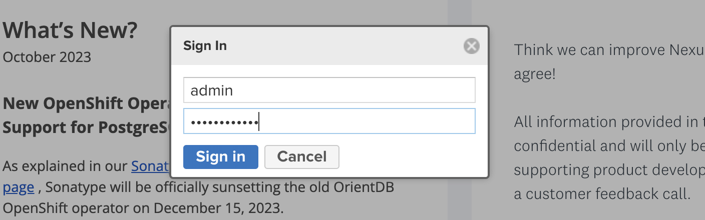
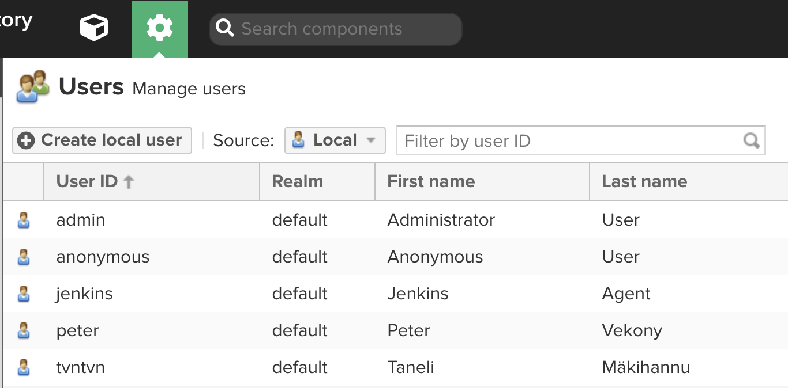
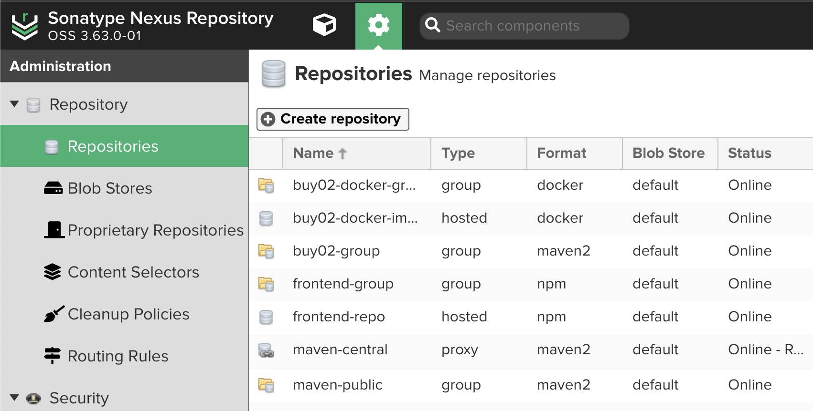
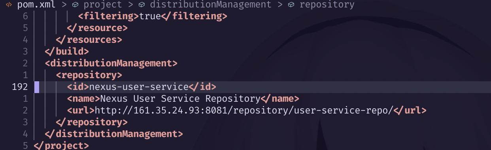
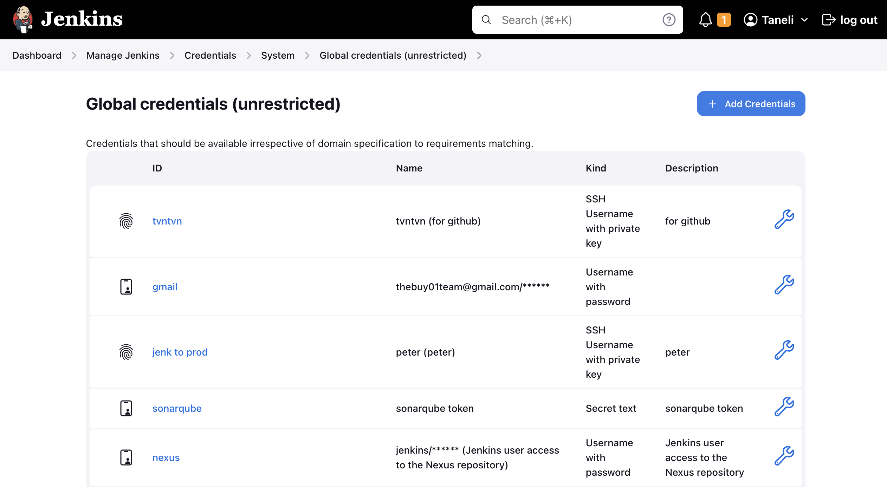
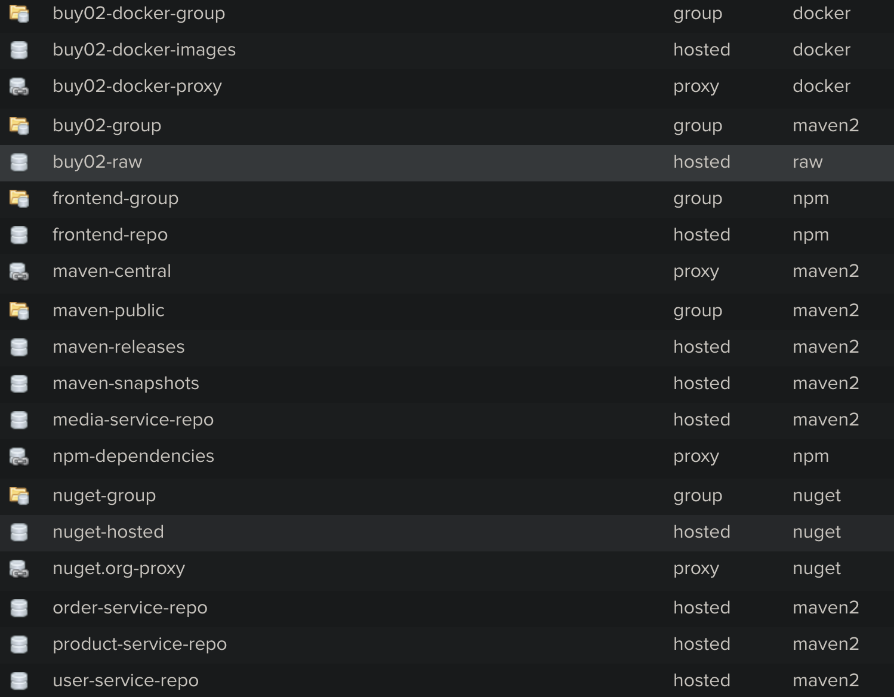

## NEXUS

This project is continuation to the
[Buy-01 & Buy-02](https://github.com/peter.vekony/buy-01),
[Mr-jenk](https://github.com/peter.vekony/buy-01) and
[Safezone](https://github.com/peter.vekony/buy-01) projects. The Purpose is to
add Sonatype Nexus Repository to the pipeline, to store the build artifacts and
external dependencies for the project.

---

#### SETUP & CONFIGURATION steps:

- Create a new Droplet on Digital Ocean
- Create users for teammembers, so there's no need to use root user
- Set up SSH keys for the team members and SSH into the machine
- Install docker on the droplet:<br>
  ```bash
  sudo apt-get install docker-ce docker-ce-cli containerd.io docker-buildx-plugin docker-compose-plugin
  ```
- Download the
  [**Official Nexus Docker Image**](https://github.com/sonatype/docker-nexus3)<br>
  ```bash
  docker pull sonatype/nexus3
  ```
- Create volume for the container for data persistance:<br>
  ```bash
  docker volume create --name nexus-data
  ```
- Run the container in interactive mode to get access to the default admin
  password:<br>

  ```bash
  docker run -it -p 8081:8081 --name nexus -v nexus-data:/nexus-data sonatype/nexus3 /bin/bash
  ```

  <div align="center">
      
  </div>

- Access the nexus dashboard and set up users with appropriate permissions:

  <div align="center">
      
  </div>

- Create repositories for the build artifacts:

  <div align="center">
      
  </div>

- Add Nexus repository URL to the **pom.xml** of the micro-services:

  <div align="center">
      
  </div>

- Go to **Jenkins** server and create `.m2/settings.xml` file for the jenkins
  user:

  <div align="center">
      
  </div>

- In **Jenkins** server, create `.npmrc` file for the jenkins user:

```bash
registry=http://161.35.24.93:8081/repository/frontend-group/
email=notarealperson@justabot.com
always-auth=true
//161.35.24.93:8081/repository/npm-dependencies/:_authToken="****************************"
//161.35.24.93:8081/repository/frontend-repo/:_auth="****************************"
//161.35.24.93:8081/repository/frontend-group/:_auth="****************************"
```

- Modify the `angular/package.json` file, add **registry** and set **private**
  to false:

  <div align="center">
      
  </div>

- Create new credentials for the **Jenkins** server to access the **Nexus**:

  <div align="center">
      
  </div>

- Modify the [**Jenkinsfile**](Jenkinsfile)

- Run the pipeline and see the build artifacts in the Nexus repository.

#### Version control

The project uses consistent versioning between all modules. This means that the
1.0.0 version for the docker-compose.yml should work with 1.0.0 version of all
the other components. The version number has to be set manually in these places:

- pom.xml files:
  - root of the project (parent pom.xml)
  - user-service
  - product-service
  - media-service
  - order-service
- package.json in the angular directory

#### Available repositories

<div align="center">
      
  </div><br>

- user-service-repo (user-service artifacts)
- product-service-repo (product-service artifacts)
- media-service-repo (media-service artifacts)
- order-service-repo (order-service artifacts)
- buy02-group (group repository for all backend service jar files)
- maven-central (proxy repository for maven dependencies)
- buy02-docker-images
- buy02-raw (repository for the docker-compose files, and scripts needed to run
  the project)

## Authors

- tvntvn
- petervekony
